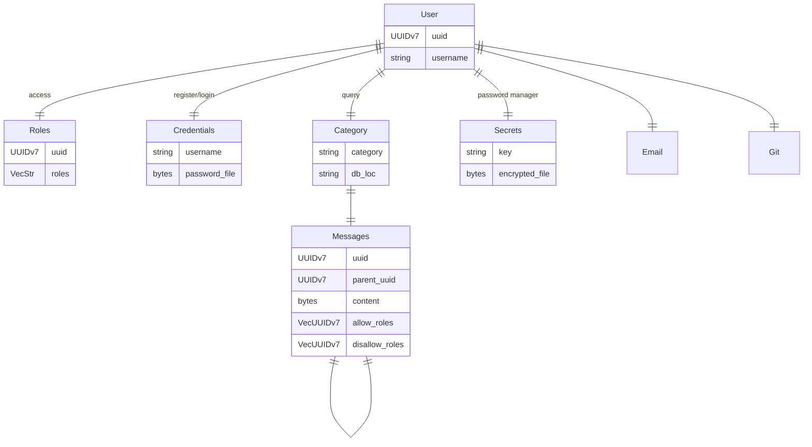

# ordinary.

[](https://crates.io/crates/ordinary)
[](https://docs.rs/ordinary/)
[](https://github.com/ordinarylabs/ordinary/blob/main/LICENSE)
[](https://deps.rs/repo/github/ordinarylabs/ordinary)

build something ordinary.

## example

```html
<h1 data-ordinary="users[:id].name">Loading...</h1>
```

## how to read the diagram

- <span style="color:blue">blue</span> highlights entry points
- <span style="color:white">white</span> highlights the path name
- <span style="color:red">red</span> highlights points of higher overhead
- <span style="color:yellow">yellow</span> highlights database queries
- <span style="color:purple">purple</span> highlights lower visibility
- <span style="color:green">green</span> highlights higher complexity of problem
- <span style="color:salmon">salmon</span> highlights FFI barrier

fat lines are for possible sends between threads. dashed lines are for memory copies between host and WebAssembly subprocess.

each path is dedicated a number. this path is the order of operations, not the architecture of the application. the application will be built on top of an LMDB datastore, which means that all threads and processes on the same machine can read from the database so long as there remains only one writer. this gives us some interesting opportunities for scaling up write capacity with sharding and spinning up multiple threads or processes, each assigned their chunk to manage (read time complexity increases but not by much).

so each thread will be free to read, and initially we will have a single thread managing only the very last part of just inserting the record into the database. over time we'll develop strategies for scaling up writes if that becomes an issue.

this graph needs to grow. this is not an exhaustive list of all the things but i would like it to become the single source of truth for the goals of the project.

`rkyv` for storage format. `bitcode` + `zstd` for wire format.

uuids are roles, and roles are uuids. when you create a role, its uuid is the only thing we use internally.

```mermaid
flowchart LR
    subgraph Entry
        style Entry fill:none,stroke:blue

        subgraph Plugins
            style Plugins fill:none
            PS1[Plugin Socket]
            PS2[Plugin Socket]
            PS3[Plugin Socket]
        end

        subgraph AuthEntry[Auth]
            style AuthEntry fill:none
            S0[Socket 0]
            S1[Socket 1]
            S2[Socket 2]
            S3[Socket 3]
            S4[Socket 4]
        end

        subgraph StoreEntry[Stores]
            style StoreEntry fill:none
            S5[Socket 5]
            S6[Socket 6]
            S7[Socket 7]
            S8[Socket 8]
        end

        subgraph Perm2[Permissions]
            style Perm2 fill:none
            S9[Socket 9]
            S10[Socket 10]
        end

        subgraph VersionControl[Version Control]
            style VersionControl fill:none
            S11[Socket 11]
        end

        subgraph Email2[Mail]
            style Email2 fill:none
            S12[Socket 12]
        end
        
        subgraph Secrets2[Secrets]
            style Secrets2 fill:none
            S14[Socket 14]
            S15[Socket 15]
        end
    end

    subgraph Paths
        style Paths fill:none,stroke:white

        subgraph Secrets1[Secrets]
            style Secrets1 fill:none;

            Gsec{{Get Secret}}
            Psec{{Put Secret}}

        end
        subgraph Email3[Mail]
            style Email3 fill:none
            Em{{Email}}
        end

        subgraph VersionCon[Version Control]
            style VersionCon fill:none
            Git1{{Git Command}}
        end

        subgraph Permissions2[Permissions]
            style Permissions2 fill:none

            AddRole{{Add Role}}
            RemoveRole{{Remove Role}}
        end

        subgraph Stores
            style Stores fill:none
            subgraph Graph
                style Graph fill:none

                GPut{{Graph Put}}
                GQuery{{Graph Query}}
            end
            subgraph Object
                style Object fill:none

                OPut{{Object Put}}
                OQuery{{Object Query}}
            end
        end

        subgraph Auth
            style Auth fill:none
        
            subgraph Registration
                style Registration fill:none
                StartReg
                FinishReg
            end
            subgraph Login
                style Login fill:none
                StartLogin
                FinishLogin
            end

            RefreshVerification
        end

        subgraph Plugins88[Plugins]
            style Plugins88 fill:none
            
            PA{{Plugin A}}
            PB{{Plugin B}}
            PC{{Plugin C}}
        end
    end


    subgraph Auth1[Auth KV]
        style Auth1 fill:none,stroke:green

        AuthWriter
        AuthWriter2
    end

    subgraph DW[Dedicated Writers]
        style DW fill:none,stroke:green

        subgraph Builder
            style Builder fill:none,stroke:green
            Build2{{Build}}
            style Build2 fill:none,stroke-width:2px,white:black,stroke-dasharray: 5 5
            B{{Build}}
        end

        subgraph Permissions[Permissions KV]
            style Permissions fill:none,stroke:green

            PermissionsWriter
            PermissionsWriter2
        end

        subgraph Main[Main Graph]
            style Main fill:none,stroke:green

            MainWriter
            MainWriter2
        end

        subgraph SecMan1[Secrets KV]
            style SecMan1 fill:none,stroke:green

            SecretWriter
            SecretWriter2
        end
    end

    S9--9-->AddRole
    AddRole==9==>V9

    S10--10-->RemoveRole
    RemoveRole==10==>V10
    
    S0--0-->StartReg
    S1--1-->FinishReg
    S2--2-->StartLogin
    S3--3-->FinishLogin

    S4--4-->RefreshVerification

    Os1[(Object Store)]
    Os2[(Object Store)]
    Os3[(Object Store)]

    subgraph Stores78[Stores]
        style Stores78 fill:none,stroke:yellow
        Os5[(5 Main Object Store)]
        Os6[(6 Main Object Store)]
        G7[(7 Main Graph Store)]
        G8[(8 Main Graph Store)]
    end

    G1[(Graph Store)]
    G2[(Graph Store)]
    G3[(Graph Store)]

    Kv1[(KV Store)]
    Kv2[(KV Store)]
    Kv3[(KV Store)]

    subgraph Authz1[Authz]
        style Authz1 fill:none,stroke:yellow
        PermsA[(Perms KV)]
        PermsB[(Perms KV)]
        PermsC[(Perms KV)]
    end

    subgraph Authz
        style Authz fill:none,stroke:yellow
        Perms5[(5 Perms KV)]
        Perms6[(6 Perms KV)]
        Perms7[(7 Perms KV)]
        Perms8[(8 Perms KV)]
        Perms9[(9 Perms KV)]
        Perms10[(10 Perms KV)]
        Perms11[(11 Perms KV)]
        Perms12[(12 Perms KV)]

        Perms14[(14 Perms KV)]
        Perms15[(15 Perms KV)]
    end

    subgraph Authn
        style Authn fill:none,stroke:red

        V5{5 Valid?}
        V6{6 Valid?}
        V7{7 Valid?}
        V8{8 Valid?}
        V9{9 Valid?}
        V10{10 Valid?}
        V11{11 Valid?}
        V12{12 Valid?}

        V14{14 Valid?}
        V15{15 Valid?}
    end

    StartReg{{Start Registration}}--0-->AuthKVStore==0==>AuthWriter
    FinishReg{{Finish Registration}}--1-->AuthKVStore1==1==>AuthWriter
    StartLogin{{Start Login}}--2-->AuthKVStore2==2==>AuthWriter
    FinishLogin{{Finish Login}}--3-->AuthKVStore3==3==>AuthWriter
    RefreshVerification{{Refresh}}--4-->AuthKVStore4==4==>Generate

    V5--5-->Perms5--5-->Os5
    S5--5-->OQuery==5==>V5
    V6--6-->Perms6--6-->Os6
    S6--6-->OPut==6==>V6
    V7--7-->Perms7--7-->G7
    S7--7-->GQuery==7==>V7
    V8--8-->Perms8--8-->G8
    G8==8==>MainWriter[Writer]
    S8--8-->GPut==8==>V8
    V9--9-->Perms9
    Perms9==9==>PermissionsWriter[Writer]
    Perms10==10==>PermissionsWriter[Writer]
    V10--10-->Perms10
    V11--11-->Perms11
    S11--11-->Git1==11==>V11
    Perms11==11==>Git
    V12--12-->Perms12
    S12--12-->Em--12-->V12
    Perms12==12==>SMTP
    Git==13==>B
    V14--14-->Perms14
    S14--14-->Gsec==14==>V14    
    Perms14--14-->Secrets
    S15--15-->Psec==15==>V15
    V15--15-->Perms15
    Perms15==15==>SecretWriter

    PS1--A-->PA==A==>VPA--A-->PermsA-.A.->PluginA
    PS2--B-->PB==B==>VPB--B-->PermsB-.B.->PluginB
    PS3--C-->PC==C==>VPC--C-->PermsC-.C.->PluginC

    A1-->MainWriter
    B2-->MainWriter
    C3-->MainWriter

    MainWriter2[Writer]
    style MainWriter2 fill:none,stroke-width:2px,white:black,stroke-dasharray: 5 5
    AuthWriter2[Writer]
    style AuthWriter2 fill:none,stroke-width:2px,white:black,stroke-dasharray: 5 5
    AuthWriter[Writer]
    SecretWriter2[Writer]
    style SecretWriter2 fill:none,stroke-width:2px,white:black,stroke-dasharray: 5 5
    SecretWriter[Writer]
    PermissionsWriter2[Writer]
    style PermissionsWriter2 fill:none,stroke-width:2px,white:black,stroke-dasharray: 5 5

    subgraph Authn1[Authn]
        style Authn1 fill:none,stroke:red
        VPA{Valid?}
        VPB{Valid?}
        VPC{Valid?}
    end

    subgraph IDLookup[ID Lookup]
        style IDLookup fill:none,stroke:yellow
        AuthKVStore[(Auth KV)]
        AuthKVStore1[(1 Auth KV)]
        AuthKVStore2[(2 Auth KV)]
        AuthKVStore3[(3 Auth KV)]
    end
    
    subgraph CR[Check Revoked]
        style CR fill:none,stroke:yellow
        AuthKVStore4[(4 Auth KV)]
    end

    subgraph Work
        style Work fill:none,stroke:red
        Generate{{Generate}}
    end 

    subgraph SecMan[Secrets Manager]
        style SecMan fill:none,stroke:yellow
        Secrets[(Secrets KV)]
    end

    subgraph Vendored
        style Vendored fill:none,stroke:purple
        subgraph VersionC[Version Control]
            style VersionC fill:none
            Git[(Git)]
        end


        subgraph Email23[Email]
            style Email23 fill:none
            SMTP[(SMTP)]
        end
    end

    subgraph Ploog[Plugins]
        style Ploog fill:none,stroke:green

        subgraph AW[WebAssembly]
            style AW fill:none,stroke:salmon
            PluginA(Plugin A)
        end
        subgraph BW[WebAssembly]
            style BW fill:none,stroke:salmon
            PluginB(Plugin B)
        end
        subgraph CW[WebAssembly]
            style CW fill:none,stroke:salmon
            PluginC(Plugin C)
        end
    end

    subgraph 10
        style 10 fill:none,stroke:none,color:transparent
        subgraph A1[A]
            style A1 fill:none,stroke:purple

            PluginA-.A.->G1
            PluginA-.A.->Kv1
            PluginA-.A.->Os1
        end

        subgraph B2[B]
            style B2 fill:none,stroke:purple

            PluginB-.B.->G2
            PluginB-.B.->Kv2
            PluginB-.B.->Os2
        end

        subgraph C3[C]
            style C3 fill:none,stroke:purple

            PluginC-.C.->G3
            PluginC-.C.->Kv3
            PluginC-.C.->Os3
        end
    end
```

if you are on a "fat line" path (i.e you're sending a value between threads) you'll need to be `Bytes` or `Vec<u8>` equivalent. all incoming requests are deserialized in the Authn red column.



## ERD

